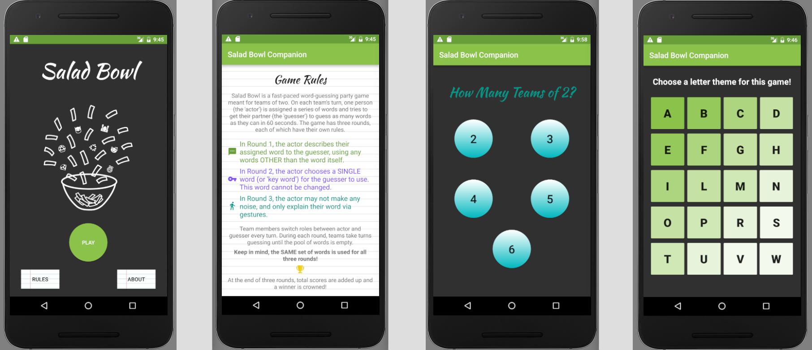
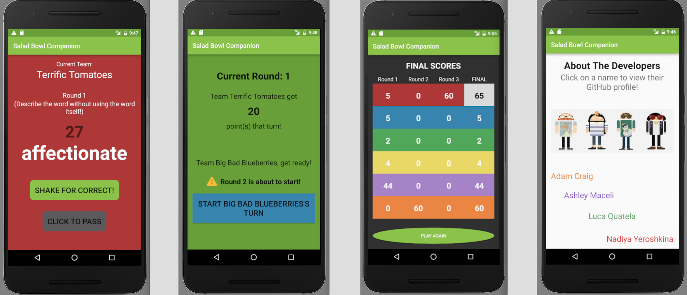

# _Salad Bowl Companion App_

#### _An Android app meant to be used to facilitate playing the party game Salad Bowl, in which teams of two take turns guessing words with increasing levels of difficulty._

#### By _**Adam Craig, Ashley Maceli, Luca Quatela, Nadiya Yeroshkina**_

## Description

_Salad Bowl is a fast-paced word-guessing party game meant for teams of two. On each team's turn, one person (the 'actor') is assigned a series of words and tries to get their partner (the 'guesser') to guess as many words as they can in 60 seconds. The game has three rounds, each of which have their own rules. This Android app is meant to be passed around during the game, and will make the game flow significantly more quickly and smoothly. Users first select a number of teams and a letter to generate the game word list from. When guessers successfully guess a word, the actor can shake their device to indicate a correct answer and go to the next word. After three rounds, points are added up and a winner is crowned! Have fun!_

## Setup/Installation Requirements

* _Ensure that Android Studio is installed on your machine._
* _Using the command line, clone the salad-bowl-game-companion repository to your desktop using the command "git clone https://github.com/AdamCraig/salad-bowl-game-companion"_
* _Open the package using Android Studio, choose your emulator, and run the app._

## Known Bugs

_The UI of the app is only optimized for phones at this time. The app is functional but not visually appealing on tablets or very large phones._

## Support and contact details

_For all issues and support, please contact:
* _Adam Craig at ajcraig@suffolk.edu_
* _Ashley Maceli at ashley.maceli@gmail.com_
* _Luca Quatela at lucaqq@gmail.com_
* _Nadiya Yeroshkina at nadin.yeroshkina@gmail.com_

## Technologies Used

_Java, Gradle, Android Framework, Android Studio, Corpora Word API_

### License

The MIT License (MIT)

Copyright (c) 2016 Adam Craig, Ashley Maceli, Luca Quatela, Nadiya Yeroshkina

Permission is hereby granted, free of charge, to any person obtaining a copy
of this software and associated documentation files (the "Software"), to deal
in the Software without restriction, including without limitation the rights
to use, copy, modify, merge, publish, distribute, sublicense, and/or sell
copies of the Software, and to permit persons to whom the Software is
furnished to do so, subject to the following conditions:

The above copyright notice and this permission notice shall be included in all
copies or substantial portions of the Software.

THE SOFTWARE IS PROVIDED "AS IS", WITHOUT WARRANTY OF ANY KIND, EXPRESS OR
IMPLIED, INCLUDING BUT NOT LIMITED TO THE WARRANTIES OF MERCHANTABILITY,
FITNESS FOR A PARTICULAR PURPOSE AND NONINFRINGEMENT. IN NO EVENT SHALL THE
AUTHORS OR COPYRIGHT HOLDERS BE LIABLE FOR ANY CLAIM, DAMAGES OR OTHER
LIABILITY, WHETHER IN AN ACTION OF CONTRACT, TORT OR OTHERWISE, ARISING FROM,
OUT OF OR IN CONNECTION WITH THE SOFTWARE OR THE USE OR OTHER DEALINGS IN THE
SOFTWARE.
